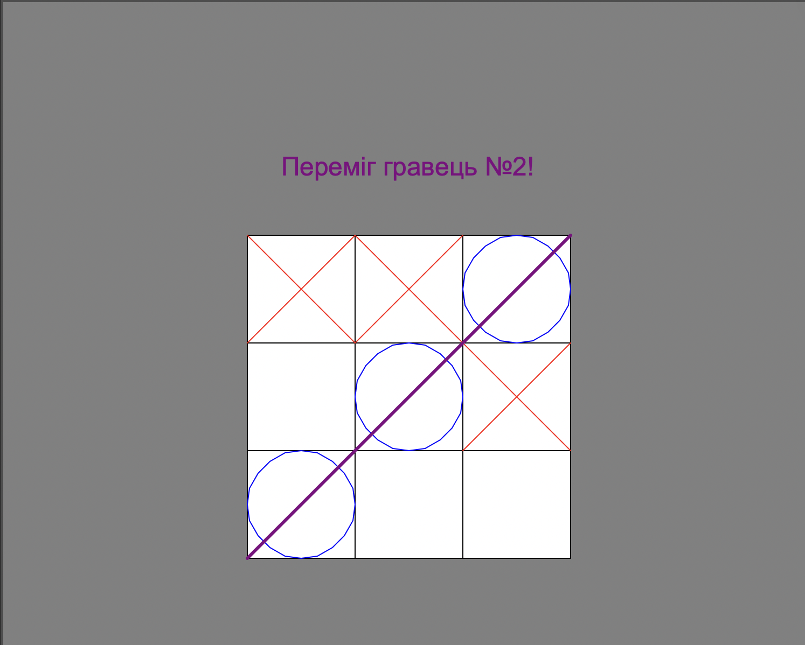

# ⭕❌ TicTacToe — Turtle Graphics Game / Гра «Хрестики-нулики»

---

## 🌐 Language / Мова

- [🇬🇧 English](#english-version)
- [🇺🇦 Українська](#ukrainian-version)

---

<a name="english-version"></a>
# 🇬🇧 English Version

## 📌 Table of Contents
1. [Project Purpose](#1-project-purpose)
2. [Team Composition](#2-team-composition)
3. [File Contents](#3-file-contents)
4. [Modules & Technologies](#4-modules--technologies)
5. [How to Run](#5-how-to-run)
6. [Project Overview](#6-project-overview)
7. [Conclusion](#7-conclusion)

---

## 1. Project Purpose

**TicTacToe** is a graphical desktop game built in Python that demonstrates core programming concepts for beginners:

- Using **lists** to represent and track game state (a 3x3 board)
- Working with **conditions** (`if/elif/else`) to validate moves and detect outcomes
- Using **loops** (`while`, `for`) to draw the board and check win combinations
- Handling **mouse events** (`onscreenclick`) to turn pixel coordinates into board cells
- Drawing graphics and writing text on screen with the **`turtle`** library
- Structuring a script into small, reusable **functions**

This project is ideal for a beginner to see how all these concepts work together in a real, playable, visual product — without needing any external GUI framework.

---

## 2. Team Composition

| Role | Participant | GitHub |
|------|------------|--------|
| *Developer* | *Nikita Huslystyi* | [NikitaHuslystyi](https://github.com/NikitaHuslystyi) |
---

## 3. File Contents

```
TicTacToe/
│
└── Tic_Tac_Toe.py     # Main game file — board drawing, click handling, win/draw logic
```

**Navigation through `Tic_Tac_Toe.py`:**
- Lines 1–16 — Imports, screen setup, board coordinates and game-state lists
- Lines 18–56 — `draw_line()` — draws the winning line through 3 cells
- Lines 58–86 — `check_victory()` / `check_draw()` — outcome detection
- Lines 89–116 — `paint_nolik()`, `paint_krestik()`, `paint_square()` — drawing marks and cells
- Lines 118–140 — `square_coordinates_krestik()` — main click handler / game logic
- Lines 142–161 — Board drawing loop and screen event binding

---

## 4. Modules & Technologies

| Module | Purpose |
|--------|---------|
| `turtle` (standard library) | Draws the board, the ❌/⭕ marks, the winning line, and on-screen text |
| `Screen.onscreenclick` (part of `turtle`) | Captures mouse clicks and triggers the game logic |

**Language:** Python 3.x
**Environment:** Desktop GUI window (no external dependencies required)

---

## 🚀 5. How to Run

### Prerequisites
- Python **3.7+** installed
- `tkinter` available (ships with most Python installs; on Linux you may need `sudo apt install python3-tk`)

### Steps

1. **Clone the repository**
   ```bash
   git clone https://github.com/NikitaHuslystyi/TicTacToe.git
   cd TicTacToe
   ```

2. **Run the game**
   ```bash
   python3 Tic_Tac_Toe.py
   ```

3. **Play!**
   A game window will open with an empty 3x3 board. Click any empty cell to place your mark — Player 1 plays ❌, Player 2 plays ⭕, turns alternate automatically. The winner (or a draw) is announced directly on the board.

> ⚠️ No external libraries are required — `turtle` comes built into Python.

---

## 6. Project Overview



### 📖 Key Mechanics

| Mechanic | How it works |
|----------|--------------|
| Board state | A flat list of 9 values (`0` = empty, `1` = X, `2` = O) tracks every cell |
| Click → cell mapping | Pixel coordinates from the click are matched against each cell's coordinate range |
| Turn switching | A `turn` variable toggles between `1` and `2` after every valid move |
| Win detection | 8 predefined index combinations (rows, columns, diagonals) are checked after each move |
| Winning line | Drawn automatically once a matching combination is found |
| Draw detection | Triggered when no winning combination exists and the board is fully filled |

### 🖥️ Color Scheme

| Color | Used For |
|-------|---------|
| 🔴 Red | The ❌ mark |
| 🔵 Blue | The ⭕ mark |
| 🟣 Purple | The winning line |
| 🟢 Green | Victory text |
| 🟠 Orange | Draw text |

---

## 7. Conclusion

**What this project taught us:**
- How to convert raw mouse-click pixel coordinates into logical board positions
- How to track and update game state with a simple flat list
- How to detect a winner using predefined index combinations instead of complex logic
- How to draw shapes, lines, and text dynamically with `turtle`
- How to structure a procedural script into small, single-purpose functions

**How the project can grow further:**
- Add a restart button instead of relaunching the script
- Add a simple AI opponent (random move, or unbeatable minimax)
- Replace `turtle` with `tkinter` Canvas or `pygame` for smoother visuals
- Add a scoreboard to track wins across multiple rounds
- Add sound effects and improved visual styling
- Add unit tests for the win/draw detection logic

---

<a name="ukrainian-version"></a>
# 🇺🇦 Українська версія

## 📌 Зміст
1. [Мета проєкту](#1-мета-проєкту)
2. [Склад команди](#2-склад-команди)
3. [Зміст файлу](#3-зміст-файлу)
4. [Модулі та технології](#4-модулі-та-технології)
5. [Як запустити](#5-як-запустити)
6. [Зміст проєкту](#6-зміст-проєкту)
7. [Висновок](#7-висновок)

---

## 1. Мета проєкту

**TicTacToe** — це графічна десктопна гра на Python, яка демонструє базові концепції програмування для початківців:

- Використання **списків** для представлення та відстеження стану гри (поле 3×3)
- Робота з **умовами** (`if/elif/else`) для перевірки ходів та визначення результату
- Використання **циклів** (`while`, `for`) для малювання поля та перевірки переможних комбінацій
- Обробка **подій миші** (`onscreenclick`) для перетворення піксельних координат у клітинки поля
- Малювання графіки та виведення тексту на екран за допомогою бібліотеки **`turtle`**
- Структурування скрипта на невеликі, повторно використовувані **функції**

Цей проєкт ідеально підходить початківцю, щоб побачити, як усі ці концепції працюють разом у реальному, ігровому, візуальному продукті — без потреби в зовнішньому GUI-фреймворку.

---

## 2. Склад команди

| Роль | Учасник | GitHub |
|------|---------|--------|
| Розробник | *Нікіта Гуслистий* | [NikitaHuslystyi](https://github.com/NikitaHuslystyi) |
---

## 3. Зміст файлу

```
TicTacToe/
│
└── Tic_Tac_Toe.py     # Головний файл гри — малювання поля, обробка кліків, логіка перемоги/нічиєї
```

**Навігація по `Tic_Tac_Toe.py`:**
- Рядки 1–16 — Імпорти, налаштування екрана, координати поля та списки стану гри
- Рядки 18–56 — `draw_line()` — малює лінію перемоги через 3 клітинки
- Рядки 58–86 — `check_victory()` / `check_draw()` — визначення результату гри
- Рядки 89–116 — `paint_nolik()`, `paint_krestik()`, `paint_square()` — малювання позначок та клітинок
- Рядки 118–140 — `square_coordinates_krestik()` — головний обробник кліків / ігрова логіка
- Рядки 142–161 — Цикл малювання поля та прив'язка події екрана

---

## 4. Модулі та технології

| Модуль | Призначення |
|--------|-------------|
| `turtle` (стандартна бібліотека) | Малює поле, позначки ❌/⭕, лінію перемоги та текст на екрані |
| `Screen.onscreenclick` (частина `turtle`) | Захоплює клік миші та запускає ігрову логіку |

**Мова:** Python 3.x
**Середовище:** Десктопне GUI-вікно (без зовнішніх залежностей)

---

## 🚀 5. Як запустити

### Що потрібно
- Встановлений **Python 3.7+**
- Доступний `tkinter` (входить у більшість інсталяцій Python; на Linux може знадобитись `sudo apt install python3-tk`)

### Кроки

1. **Клонуйте репозиторій**
   ```bash
   git clone https://github.com/NikitaHuslystyi/TicTacToe.git
   cd TicTacToe
   ```

2. **Запустіть гру**
   ```bash
   python3 Tic_Tac_Toe.py
   ```

3. **Грайте!**
   Відкриється вікно гри з порожнім полем 3×3. Клікніть у будь-яку вільну клітинку, щоб поставити свою позначку — Гравець 1 грає ❌, Гравець 2 грає ⭕, ходи чергуються автоматично. Переможець (або нічия) оголошується прямо на полі.

> ⚠️ Жодні зовнішні бібліотеки не потрібні — `turtle` вбудована в Python.

---

## 6. Зміст проєкту


### 📖 Ключові механіки

| Механіка | Як працює |
|----------|-----------|
| Стан поля | Плаский список із 9 значень (`0` — порожньо, `1` — X, `2` — O) відстежує кожну клітинку |
| Зв'язок кліку з клітинкою | Піксельні координати кліку зіставляються з діапазоном координат кожної клітинки |
| Перемикання ходу | Змінна `turn` перемикається між `1` та `2` після кожного дійсного ходу |
| Визначення перемоги | Після кожного ходу перевіряються 8 заданих комбінацій індексів (рядки, стовпці, діагоналі) |
| Лінія перемоги | Малюється автоматично, коли знайдено відповідну комбінацію |
| Визначення нічиєї | Спрацьовує, коли переможної комбінації немає, а поле повністю заповнене |

### 🖥️ Колірна схема

| Колір | Використовується для |
|-------|---------------------|
| 🔴 Червоний | Позначка ❌ |
| 🔵 Синій | Позначка ⭕ |
| 🟣 Пурпурний | Лінія перемоги |
| 🟢 Зелений | Текст перемоги |
| 🟠 Оранжевий | Текст нічиєї |

---

## 7. Висновок

**Чому проєкт був корисним та чого навчилися:**
- Як перетворювати піксельні координати кліку миші на логічні позиції поля
- Як відстежувати та оновлювати стан гри за допомогою простого плаского списку
- Як визначати переможця через задані комбінації індексів замість складної логіки
- Як динамічно малювати фігури, лінії та текст за допомогою `turtle`
- Як структурувати процедурний скрипт на невеликі функції з єдиною відповідальністю

**Як можна розвивати проєкт далі:**
- Додати кнопку перезапуску замість повторного запуску скрипта
- Додати простого ШІ-суперника (випадковий хід або непереможний minimax)
- Замінити `turtle` на `tkinter` Canvas або `pygame` для плавнішої графіки
- Додати таблицю результатів для відстеження перемог у кількох раундах
- Додати звукові ефекти та покращене візуальне оформлення
- Додати юніт-тести для логіки визначення перемоги/нічиєї
